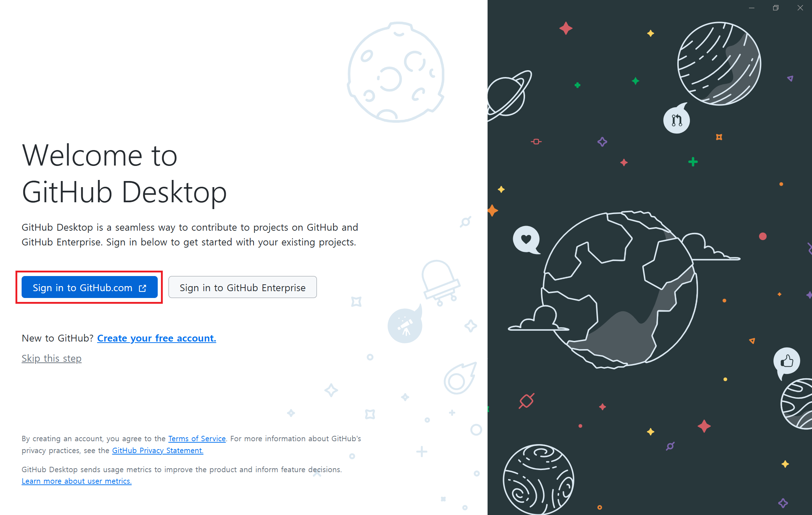
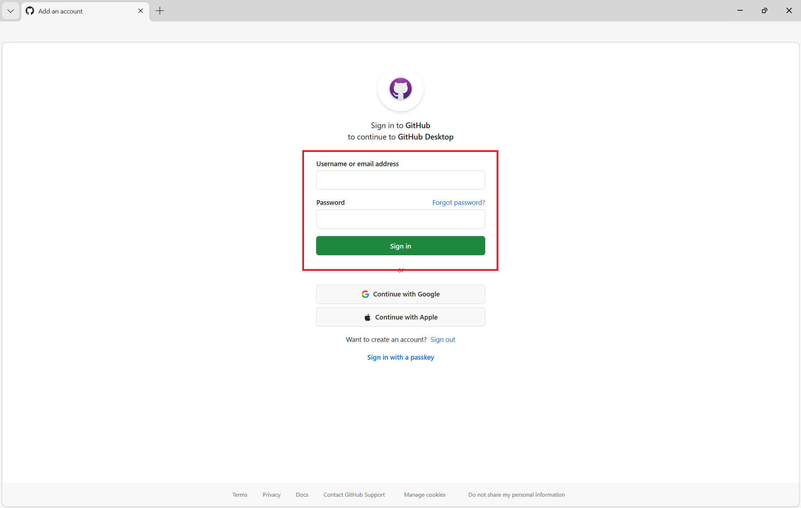
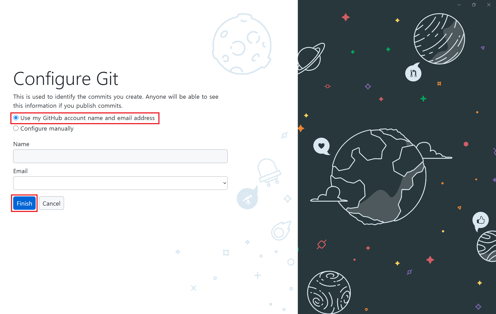

# STEP 05: GitHub Desktop으로 저장소 클론하기

## 클론(Clone)이란?
클론(Clone)은 GitHub의 저장소를 로컬 컴퓨터에 복사하는 작업입니다.

## 클론 방법

### 1단계: GitHub Desktop 실행
GitHub Desktop을 실행합니다.

### 2단계: GitHub 계정 로그인
GitHub Desktop을 처음 실행할 경우, GitHub 계정으로 로그인합니다.

`Sign in to GitHub.com`을 선택합니다
  

GitHub 계정으로 로그인을 진행합니다.
  

`Use my GitHub account name and email address`를 선택합니다.

`Name`과 `Email`이 올바른지 확인후 `Finish`버튼을 클릭합니다.
  

로그인이 정상적으로 되었습니다!
  

### 3단계: 저장소 클론

왼쪽 상단에 있는 `File` > `Clone Repository`를 선택합니다.
  

### 4단계: 저장소 선택 및 Clone 버튼 클릭

`GitHub.com`선택 후 [STEP 04: GitHub 저장소 생성](./step04-create-repository.md)에서 생성한 레포지토리를 찾아 선택합니다.

`Local Path`에서 `Choose..`버튼을 클릭하여 파일을 저장할 로컬 경로를 선택합니다. (예: 바탕화면)

모두 선택한 후 `Clone`버튼을 클릭하여 저장소를 다운로드합니다.
  

## 클론 완료

저장소가 로컬 컴퓨터에 성공적으로 복사되었습니다!

---

👈 이전: [STEP 04: GitHub 저장소 생성](./step04-create-repository.md)
👉 다음: [STEP 06: 로컬에서 파일 수정 또는 생성](./step06-modify-files-locally.md)
