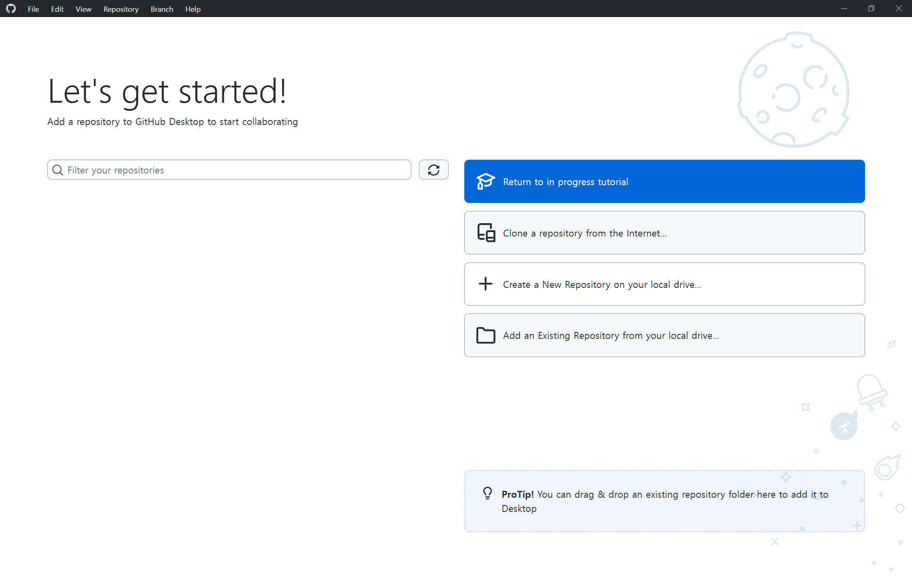
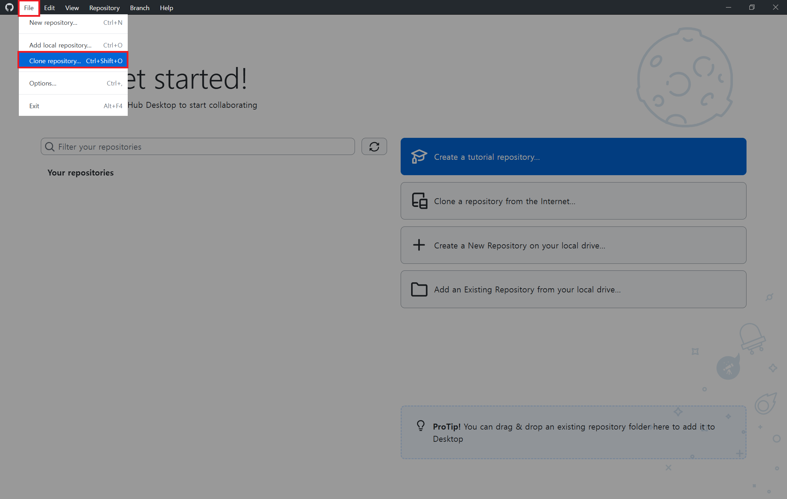
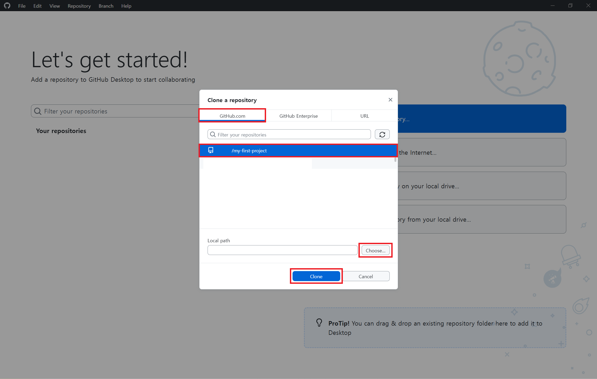
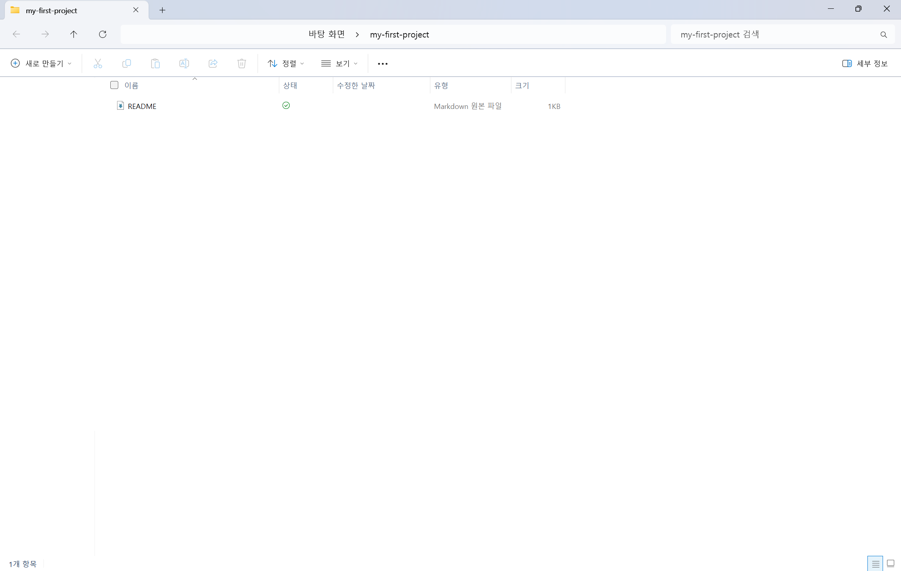

# STEP 05: GitHub Desktop으로 저장소 클론하기

## 🎯 이 단계에서 배우는 것
GitHub에 만든 저장소를 내 컴퓨터로 가져오는 방법입니다. 이 과정을 통해 원격 저장소와 내 컴퓨터 작업 공간을 연결하는 첫 단계를 익힙니다.

## 📚 클론(Clone)이 뭔가요?
클론(Clone)은 GitHub의 저장소를 내 컴퓨터에 복사하는 작업입니다.

> [!IMPORTANT]
> 🍎 **macOS 사용자**(맥북, 아이맥 등)는 [macOS용 STEP 05 문서](/docs/macos/step05-clone-repository.md)를 클릭해 이동합니다.

## 🔽 클론하기

### 1단계: GitHub Desktop 실행
GitHub Desktop을 실행합니다.

### 2단계: GitHub 계정 로그인
GitHub Desktop을 처음 실행할 경우, GitHub 계정으로 로그인합니다.

> 로그인을 안 했다면 [STEP 03: GitHub Desktop 설치 안내](./step03-github-desktop-installation.md)로 돌아가 로그인을 진행합니다.

### 3단계: 저장소 클론

왼쪽 상단에 있는 `File` > `Clone Repository`를 선택합니다.

### 4단계: 저장소 선택 및 Clone 버튼 클릭

1. `GitHub.com` 선택 후 [STEP 04: GitHub 저장소 생성](./step04-create-repository.md)에서 생성한 저장소를 찾아 선택합니다.

2. `Local Path`에서 `Choose...` 버튼을 클릭하여 파일을 저장할 내 컴퓨터 속 경로를 선택합니다. (예: 바탕화면)

3. 모두 선택한 후 `Clone(클론)` 버튼을 클릭하여 저장소를 다운로드합니다.

## ✅ 완료!
축하합니다! 🎉 GitHub 저장소를 내 컴퓨터로 성공적으로 가져왔습니다!

아래와 같이 내 컴퓨터에서 확인할 수 있다면 저장소를 내 컴퓨터에 성공적으로 복사한 것입니다.

이제 우리는 GitHub에 있던 원격 저장소를 내 컴퓨터와 연결했고, 실제로 내 컴퓨터에서 파일을 수정할 수 있는 준비를 마쳤습니다.

다음 단계에서는 이 저장소 안의 파일을 직접 수정하거나 새로 만들어보면서, Git이 변경 사항을 어떻게 인식하는지 배워볼 예정입니다.

---

👈 이전: [STEP 04: GitHub 저장소 생성하기](./step04-create-repository.md)

👉 다음: [STEP 06: 내 컴퓨터에서 파일 수정 또는 생성하기](./step06-modify-files-locally.md)
