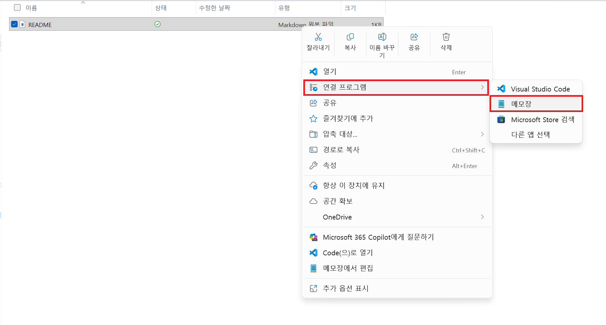
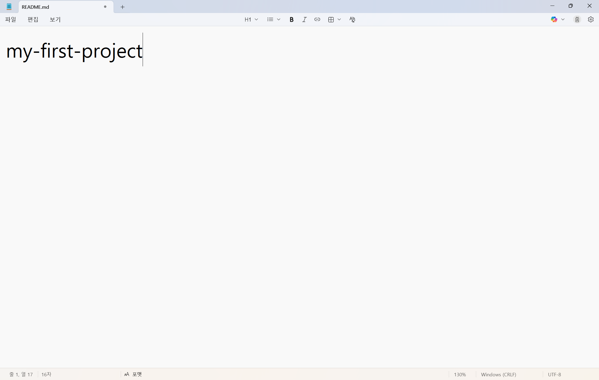
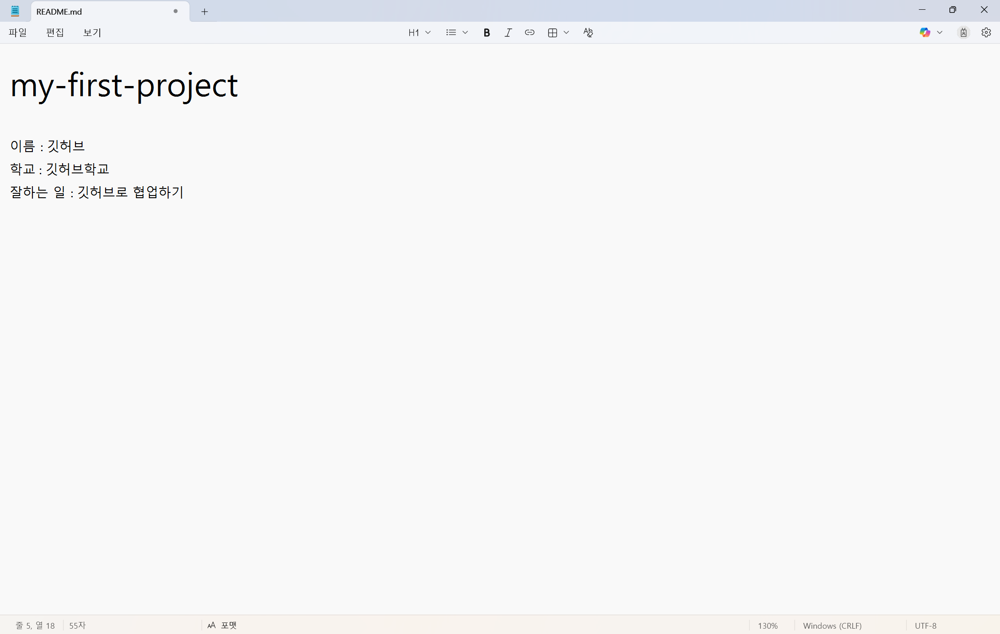

# STEP 06: 내 컴퓨터에서 파일 수정 또는 생성

## 🎯 이 단계에서 배우는 것
내 컴퓨터에 있는 저장소 파일을 직접 수정하거나 새로 만드는 방법입니다. 파일을 바꾸면 GitHub Desktop에서 어떤 내용이 변경되었는지도 함께 확인할 수 있습니다.

## 📂 파일 수정 또는 생성하기

### 1단계: 파일 열기


내 컴퓨터에서 클론된 폴더를 찾습니다.

폴더 내에 편집할 파일을 오른쪽 마우스로 클릭 후 `연결 프로그램`을 선택한 후, `메모장`을 선택합니다.

### 2단계: 파일 편집


파일이 제대로 열렸는지 확인합니다.



파일을 수정합니다.

#### 예제

```
이름: 깃허브
학교: 깃허브학교
잘하는 일: 깃허브로 협업하기
```
위 내용을 추가합니다.

## 변경 사항 확인
파일 저장 후, GitHub Desktop에서 변경 사항이 자동으로 감지됩니다.
즉, 내가 어떤 파일을 수정했는지 GitHub Desktop에서 바로 확인할 수 있습니다.

## ✅ 완료!
축하합니다!🎉 내 컴퓨터 속 저장소에서 파일을 직접 수정하거나 새로 만드는 작업을 성공적으로 해냈습니다!

이제 우리는 내 컴퓨터에서 프로젝트 파일을 편집하는 방법을 익혔고, 파일을 저장하면 GitHub Desktop이 변경 내용을 자동으로 보여준다는 것도 확인했습니다.

다음 단계에서는 이렇게 수정한 내용을 커밋해서 기록으로 남기고, GitHub 웹사이트에 업로드하는 방법을 배워볼 거예요.

---

👈 이전: [STEP 05: GitHub Desktop으로 저장소 클론](./step05-clone-repository.md)
👉 다음: [STEP 07: GitHub Desktop에서 커밋 후 푸시](./step07-local-commit-push.md)
