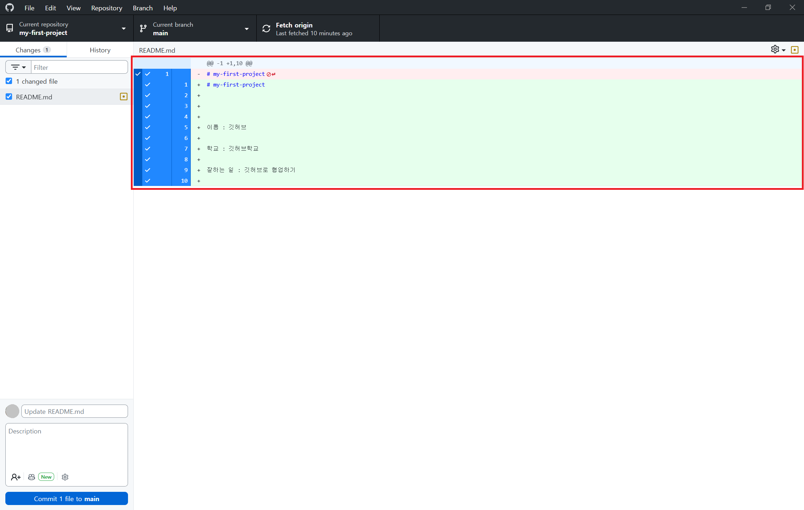
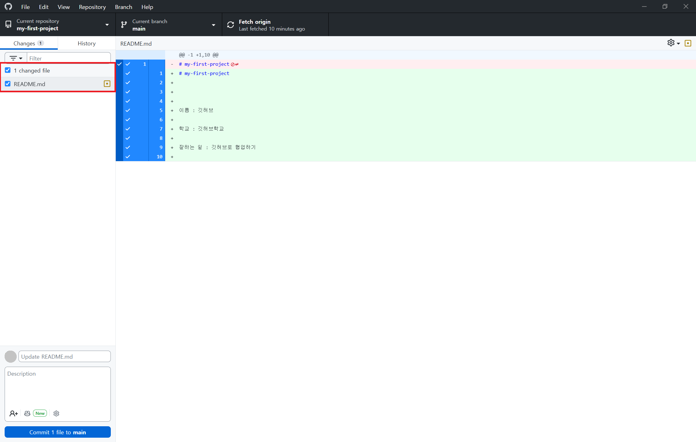
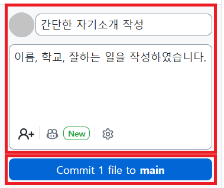
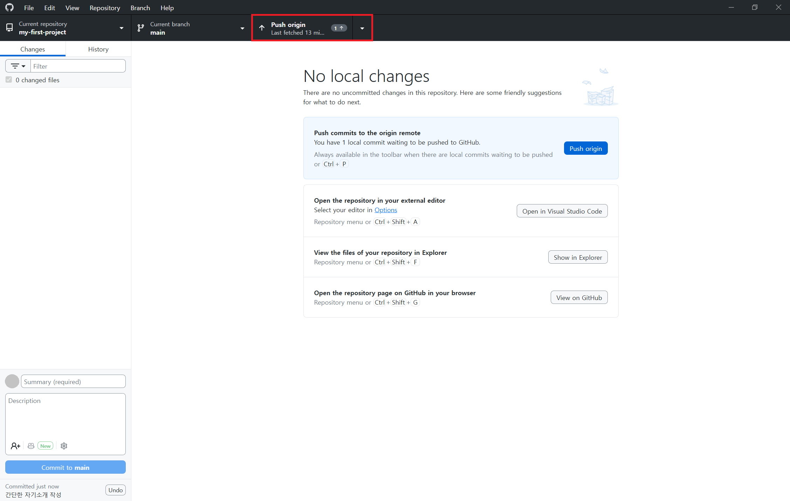
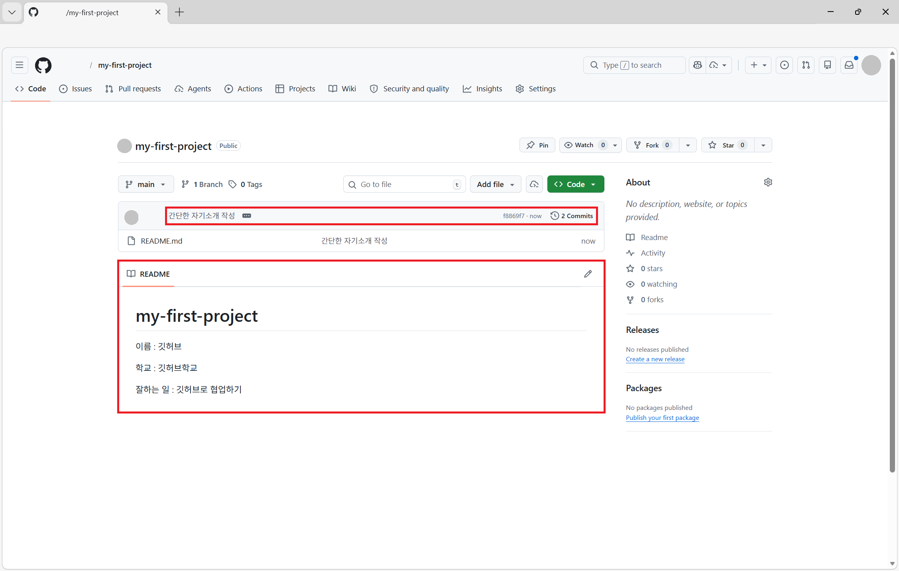

# STEP 07: GitHub Desktop에서 커밋 후 푸시하기

## 🎯 이 단계에서 배우는 것
커밋(Commit)은 수정한 파일을 그냥 저장하는 것을 넘어, 어떤 내용을 바꿨는지 기록으로 남기는 방법입니다. 커밋(Commit)을 통해 작업 내용을 차곡차곡 정리하고 관리하는 흐름을 익힙니다.

푸시(Push)는 내 컴퓨터에서 작업한 내용을 GitHub 사이트에 올리는 방법입니다. 푸시(Push)를 하면 내 컴퓨터에서 만든 변경 사항이 온라인 저장소에도 반영됩니다.

## 📚 커밋(Commit)이 뭔가요?
커밋(Commit)은 변경된 파일을 저장소의 히스토리에 기록하는 작업입니다.
> 여기서 **히스토리**는 파일을 언제 어떻게 수정했는지 남겨두는 기록이여서, 나중에 변경 내용을 다시 확인할 수 있습니다.

## 📚 푸시(Push)가 뭔가요?
푸시(Push)는 내 컴퓨터에서 커밋한 변경 사항을 GitHub의 원격 저장소에 업로드하는 작업입니다.

## ✍️ 커밋하기

### 1단계: GitHub Desktop 확인


GitHub Desktop을 열어 파일의 변경 사항을 확인합니다.

### 2단계: 파일 선택


커밋할 파일을 선택합니다. (기본적으로 모든 변경 사항이 선택됩니다.)

### 3단계: 커밋 메시지 작성


좌측 아래에 커밋 메시지를 작성합니다.
> **커밋 메세지 제목**: 이번에 무엇을 바꿨는지 한 줄로 짧게 쓰는 부분

> **커밋 메세지 본문**: 제목만으로 설명이 부족할 때, 자세한 내용을 덧붙여 쓰는 부분

어떤 수정사항이 있었는지, 그 수정사항과 자세한 설명을 작성합니다.

**좋은 커밋 메시지 예시:**
- "파일 추가"
- "버그 수정"
- "기능 추가"

#### 예제
**커밋 메세지 제목**
```
간단한 자기소개 작성
```
**커밋 메세지 본문**
```
이름, 학교, 잘하는 일을 작성하였습니다.
```

### 4단계: Commit(커밋) 버튼 클릭


`Commit to main` 버튼을 클릭하여 커밋합니다.

## 🔼 푸시하기

### 1단계: Push(푸시) 버튼 클릭


GitHub Desktop의 우측 상단에 있는 `Push origin` 버튼을 클릭합니다.

### 2단계: GitHub 웹사이트에서 확인
웹 브라우저에서 https://github.com 에 접속합니다.

### 3단계: 저장소 확인
본인의 저장소로 접속합니다.
예) my-first-project

### 4단계: 새로고침


페이지를 새로고침하여 방금 푸시한 파일이 반영되었는지 확인합니다.

커밋 메시지도 잘 작성되었는지 같이 확인합니다.

## ✅ 완료!
축하합니다! 🎉 수정한 파일을 커밋하고 GitHub까지 성공적으로 업로드했습니다!

이제 우리는 파일을 수정한 뒤, 그 내용을 커밋으로 기록하고, 푸시를 통해 GitHub 웹사이트에 반영하는 전체 흐름을 한 번 완성했습니다.

다음 단계에서는 커밋 이후 다른 변경 사항을 가져오는 방법인 풀(PULL)을 배우면서, 협업 흐름까지 더 확장해볼 거예요.

---

👈 이전: [STEP 06: 내 컴퓨터에서 파일 수정 또는 생성하기](./step06-modify-files-locally.md)
👉 다음: [STEP 08: Pull해서 GitHub 변경 내용 가져오기](./step08-remote-commit-pull.md)
