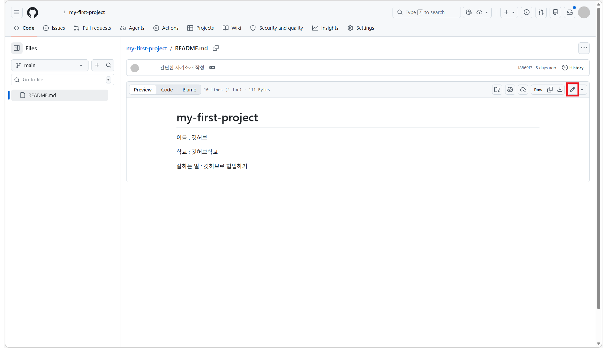
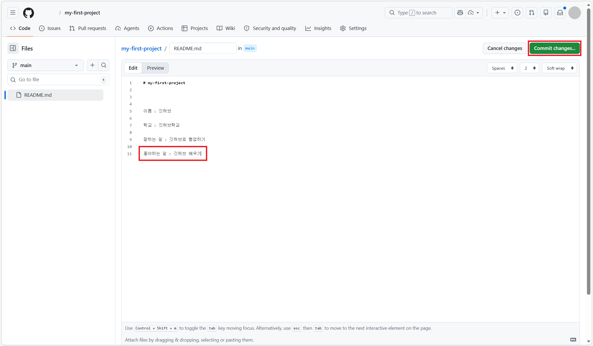
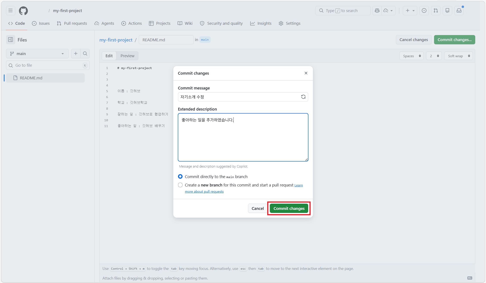
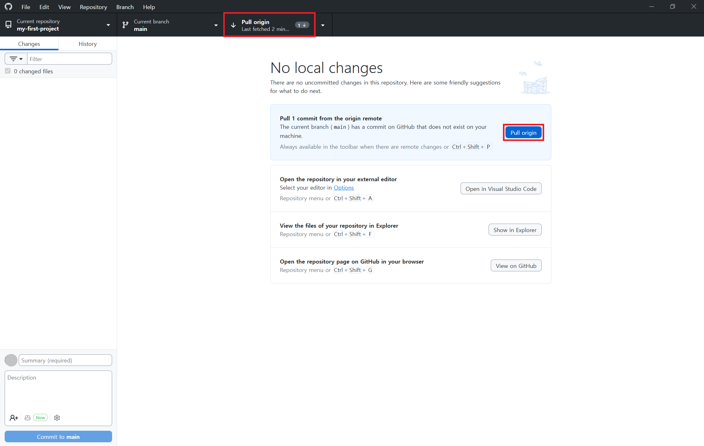
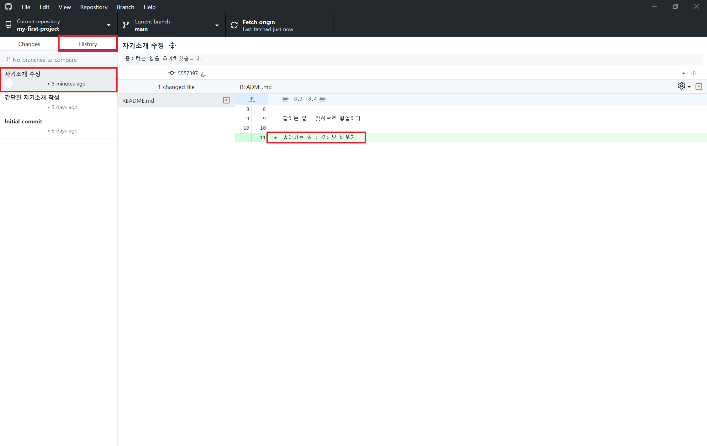

# STEP 08: 원격저장소에서 GitHub 변경 내용 가져오기

## 🎯 이 단계에서 배우는 것
GitHub 웹사이트에서 수정한 내용을 내 컴퓨터의 GitHub Desktop으로 가져오는 방법입니다. 풀(Pull)을 하여 온라인 저장소에서 바뀐 내용을 내 컴퓨터에 반영합니다.

## 📚 풀(Pull)이 뭔가요?
풀(Pull)은 앞서 이야기했던 깃허브(GitHub)의 원격 저장소(Repository)에 있는 최신 변경 내용을 내 컴퓨터로 가져오는 작업입니다.

> [!IMPORTANT]
> 🍎 **macOS 사용자**(맥북, 아이맥 등)는 [macOS용 STEP 08 문서](/docs/macos/step08-remote-commit-pull.md)를 클릭해 이동합니다.

## 🔽 GitHub에서 수정하고 풀하기

### 1단계: GitHub 웹사이트 접속
이전 [STEP 07: GitHub Desktop에서 커밋 후 푸시하기](./step07-local-commit-push.md)단계 마지막에서 복사해둔 주소를 웹브라우저에 입력하여 접속합니다.

### 2단계: 수정할 파일 선택
수정하고 싶은 파일을 클릭합니다.

### 3단계: 파일 수정하기

파일 오른쪽 위의 연필 모양 아이콘(`Edit this file`)을 클릭합니다.

파일 내용을 원하는 대로 수정합니다.

### 4단계: 웹 브라우저에서 커밋하기

수정이 끝나면 `Commit changes...` 버튼을 클릭합니다

커밋 메세지를 작성한 후, 다시 `Commit changes` 버튼을 클릭하여 커밋합니다.

### 5단계: GitHub Desktop으로 돌아오기
GitHub Desktop을 엽니다.

### 6단계: Pull 버튼 클릭

조금전 GitHub 웹에서 했던 변경 사항이 보이면 `Pull origin` 버튼을 클릭합니다.

좌측 `History` 탭을 통해 변경 사항을 내 컴퓨터에서 확인합니다.

## ✅ 완료!
축하합니다! 🎉 GitHub 웹사이트에서 수정한 내용을 커밋하고, GitHub Desktop으로 성공적으로 가져왔습니다!

이제 우리는 GitHub 웹사이트에서 파일을 수정한 뒤, 커밋으로 변경 내용을 기록하고, 풀을 통해 그 내용을 내 컴퓨터에 반영하는 흐름까지 완성했습니다.

다음 단계에서는 이슈(Issue)를 생성하면서, 해야 할 일이나 수정할 내용을 GitHub에서 정리하고 관리하는 방법을 배웁니다.

---

👈 이전: [STEP 07: GitHub Desktop에서 커밋 후 푸시하기](./step07-local-commit-push.md)

👉 다음: [STEP 09: 이슈 생성하기](./step09-create-issue.md)
