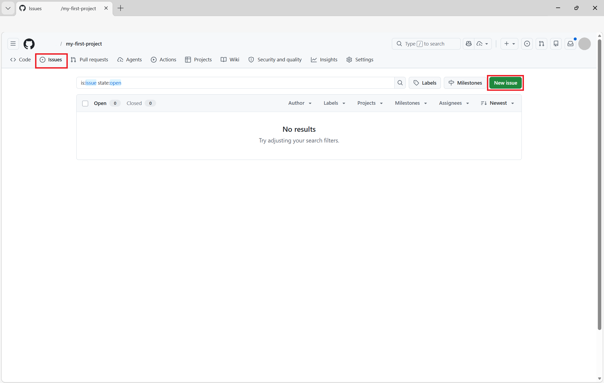
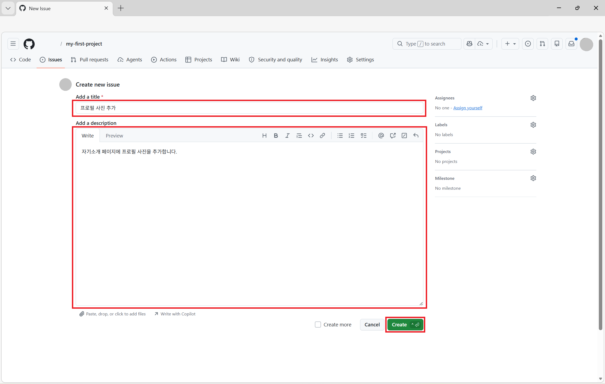
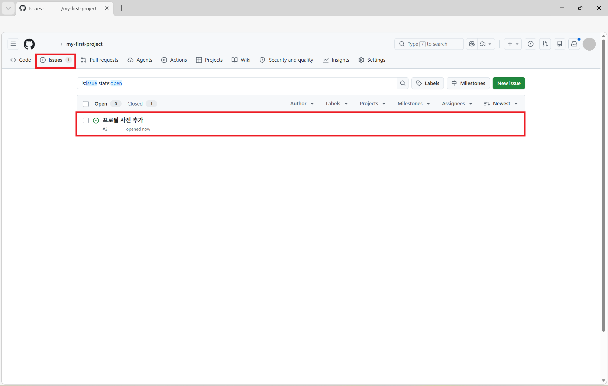
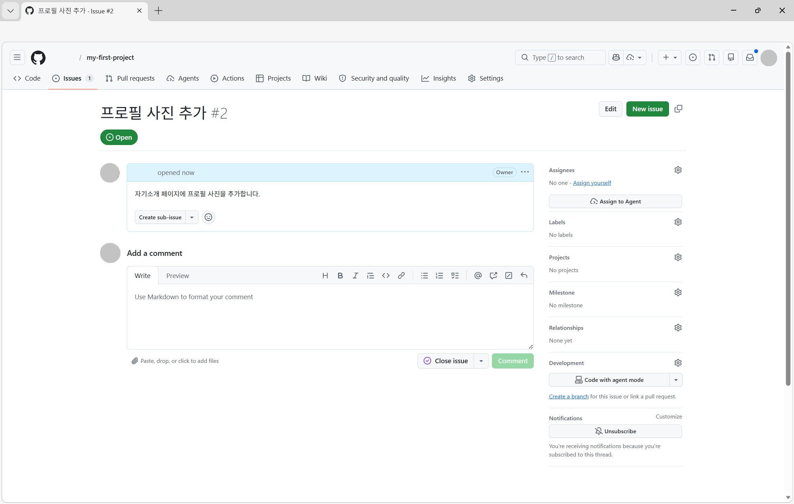
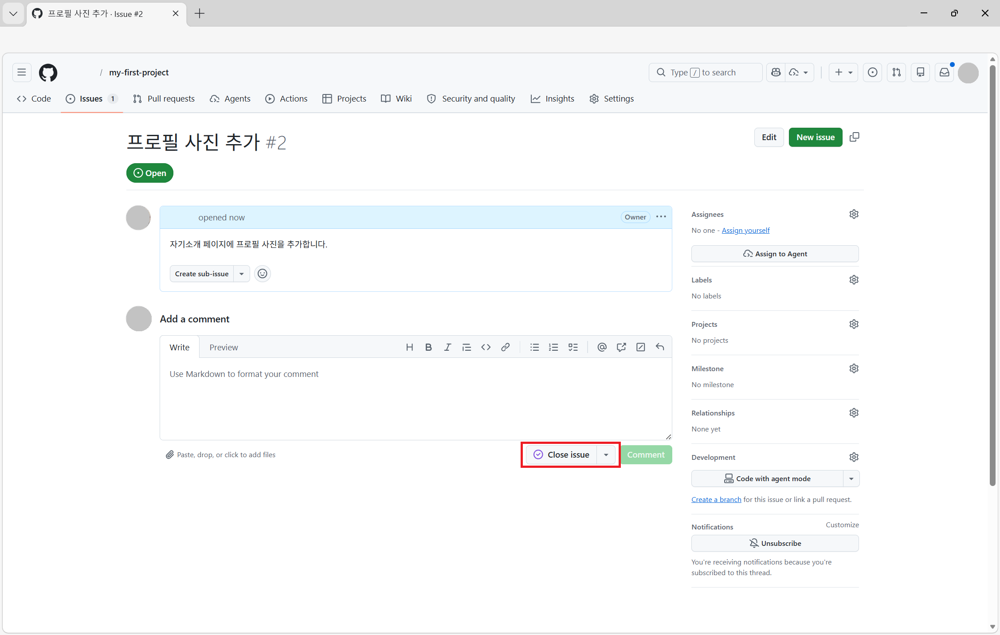
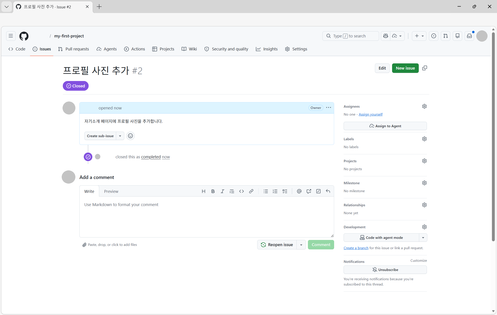
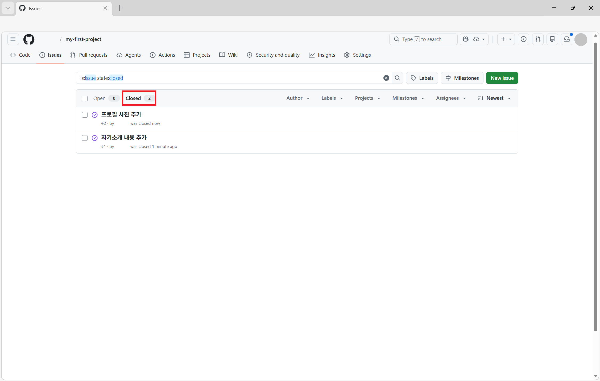

# STEP 09: Issue 생성

## 이슈(Issue)란?
이슈(Issue)는 버그 보고, 기능 제안, 작업 할당 등을 관리하는 도구입니다.

## Issue 생성 방법

### 1단계: 저장소 접속
GitHub에서 본인의 저장소에 접속합니다.

### 2단계: Issue 생성 시작

저장소 페이지의 `Issues` 탭을 클릭합니다.

`New issue` 버튼을 클릭합니다.

### 3단계: 이슈 작성

- **Title**: 이슈의 제목을 입력합니다.
- **Description**: 이슈에 대한 설명을 상세히 작성합니다.

#### 예제:
- Title: "프로필 사진 추가"
- Description: "자기소개 페이지에 프로필 사진을 추가합니다."

### 4단계: Issue 생성

`Create` 버튼을 클릭하여 이슈를 생성합니다.

## Issue 생성 완료

성공적으로 이슈가 생성되었습니다!

생성된 이슈를 확인할 수 있습니다.

### 5단계: Issue 닫기

완료한 이슈를 선택해 닫을 수 있습니다.

우측하단에 `Close issue` 버튼을 클릭합니다.

### 6단계: Issue 닫기 완료

이슈가 닫혔습니다.

`Closed` 탭에서 닫힌 이슈들을 확인할 수 있습니다.

---

👈 이전: [STEP 08: Push해서 GitHub으로 올리기](./step08-push-to-github.md)

## 축하합니다! 🎉
모든 단계를 완료했습니다. 이제 GitHub를 사용할 준비가 되었습니다!
